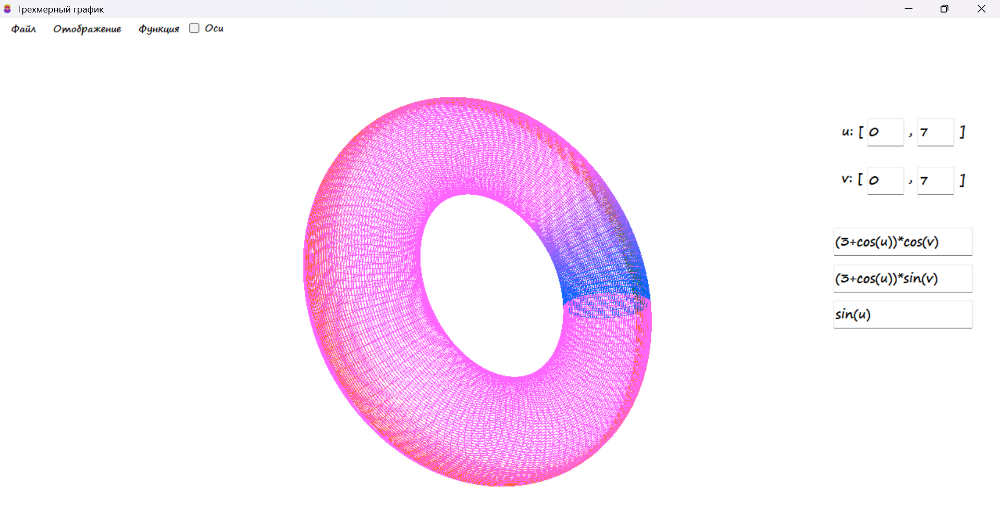

В данном репозитории находятся лабораторные работы и небольшие проекты, написанные на C#. К каждой программа прикреплена видео/фото инструкция, которая описывает ее работу. Описание программ:

1. "График 3Д" - программа позволяющая визуализировать трехмерные графики функций с помощью простого ввода функции в текстовое окно интерфейса (поддерживает явные и параметрические уравнения). Визуализированные графики можно вращать, менять масштаб и задавать способ отображения в пользовательском интерфейсе. Поддерживает загрузку набора точек вместо явного ввода функции. Полученные результаты можно сохранять (например в виде набора точек) и использовать в своем коде или сторонних программах.

2. "Фазовый портрет" - данная программа позволяет строить фазовые портреты для простых систем дифференциальных уравнений 2 порядка. Уравнения вводятся в текстовое поле пользовательского интерфейса, после чего происходит процесс визуализации. В соответствующих полях можно задать интервалы и количество шагов. 

3. "Математическая морфология" - программа позволяет иллюстрировать процесс морфологической обработки на небольших структурных примитивах. Пользователь может посмотреть процесс применения морфологических операций (объединение, дполнение, замыкание и др.) на структурном элементе с применением различных операторов. Программа может использоваться в качестве обучающей для понимания процесса применения данных операций к реальным изображениям. 

4. "Определенный интеграл" - позволяет численно найти определенный интеграл от пользовательской функции. Функция записывается пользователем в интерфейсе программы (в явном или параметрическом виде), а также указываются границы отрезка. Программа вычисляет интеграл от введенной функции и визуализирует соответствующую площадь под графиком. 

5. "Игра Арканоид" - классическая игра с движущейся платформой, цель которой - попасть движущимся мячом во все блоки на карте. В настройках игры можно задать сложность и изменить формат игры. 

6. "Редактор фотографий" - программа для редактирования изображений с ярким интерфейсом, позволяющая редактировать снимки методами компьютерной обработки изображений. Программа имеет следующие возможности: позволяет привести изображение к оттенкам серого, изменить яркость, бинаризовать, добавить водяной знак, удалять/добавлять шум, применять методы математической морфологии к бинаризованным изображениям, выделять границы, применять фильтрацию (в том числе с пользовательским фильтром), менять цветовую модель и другие возможности для редактирования. 

7. "Сравнение функций" - эта небольшая программа позволяет сравнивать две функции на заданном отрезке и находить погрешность между ними. Графики функций отображаются в интерфейсе программы, визуализируя пространство точек между ними, также доступен график погрешности. Программа может быть полезна в лабораторных работах, когда необходимо оценить отклонение одной функции от другой (например при сравнении исходной и аппроксимирующей функции). 

Более подробные описания работы программ расположены в соответстующих директориях. 
