**График 3Д** - программа позволяющая визуализировать трехмерные графики функций с помощью простого ввода функции в текстовое окно интерфейса (поддерживает явные и параметрические уравнения). Визуализированные графики можно вращать, менять масштаб и задавать способ отображения в пользовательском интерфейсе. Поддерживает загрузку набора точек вместо явного ввода функции. Полученные результаты можно сохранять (например в виде набора точек) и использовать в своем коде или сторонних программах.

## Пример использования:

При открытии программы появляется пользовательское окно, в котором можно вводить желаемую функцию. Программа визуализирует ее график в виде сетки значений. Визуализируемую фигуру можно вращать кнопками W, S, A, D, Q, E и отдалять/приближать колесиком мыши. Также в пользовательском интерфейсе можно менять границы значений переменных.

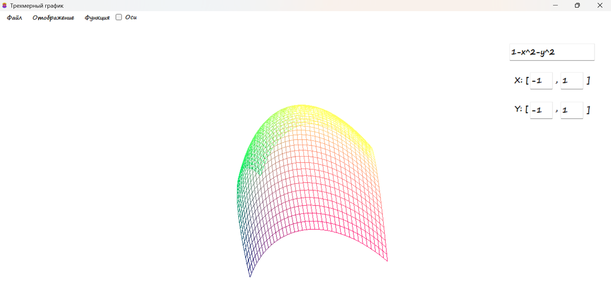

Способ визуализации можно изменить в настройках отображения, выбрав точки или полигоны.

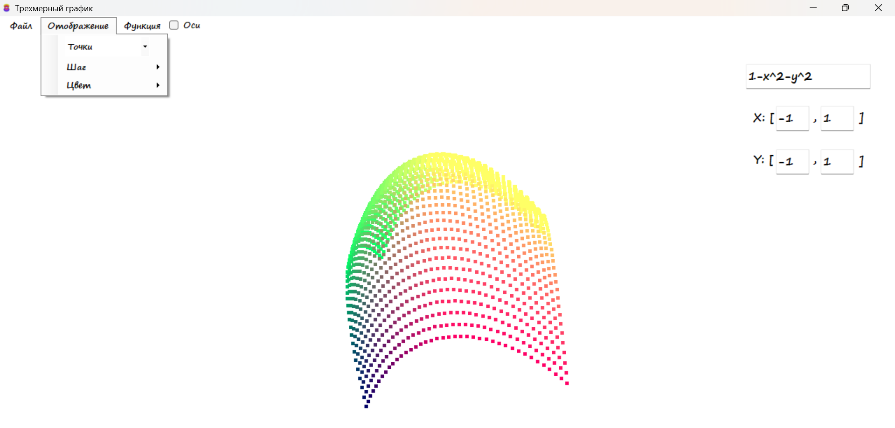

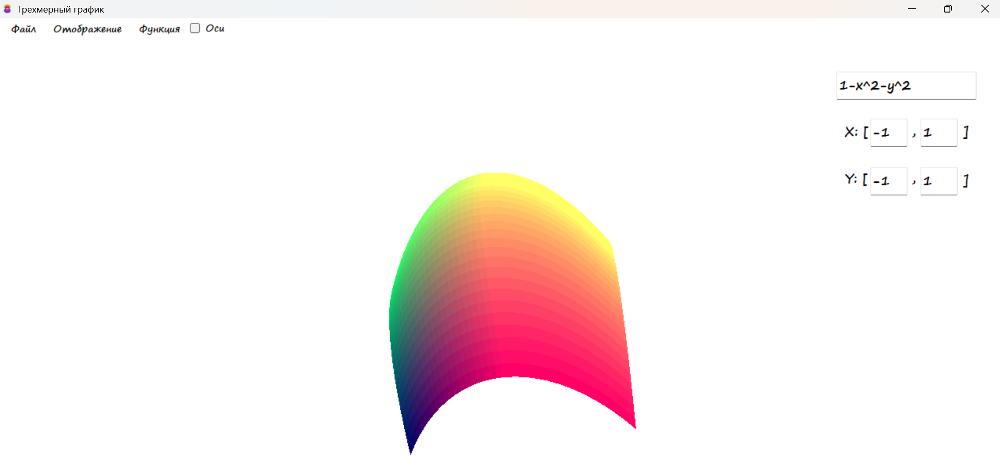

Также в настройках отображения можно поменять цвет графика функции на одну из предустановленных палитр. 

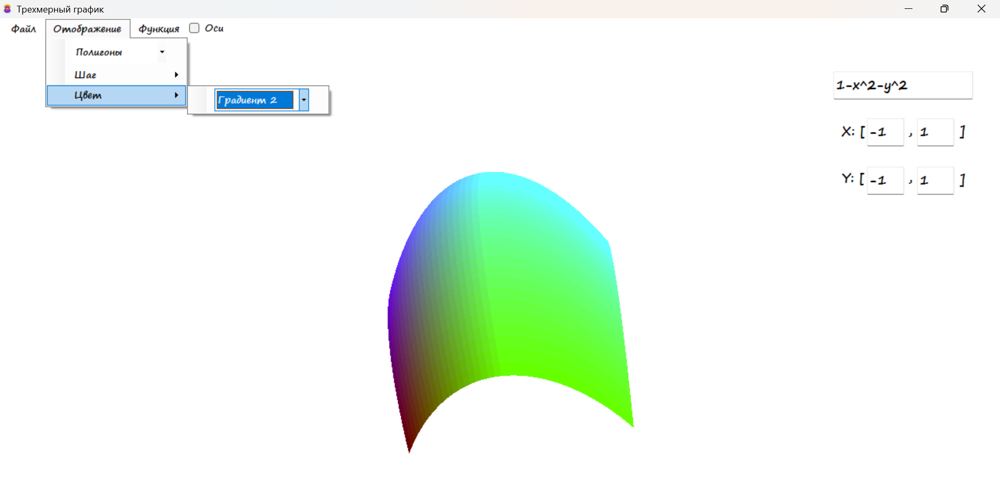

Отметив галочку "Оси" можно добавить отображение координатных осей.

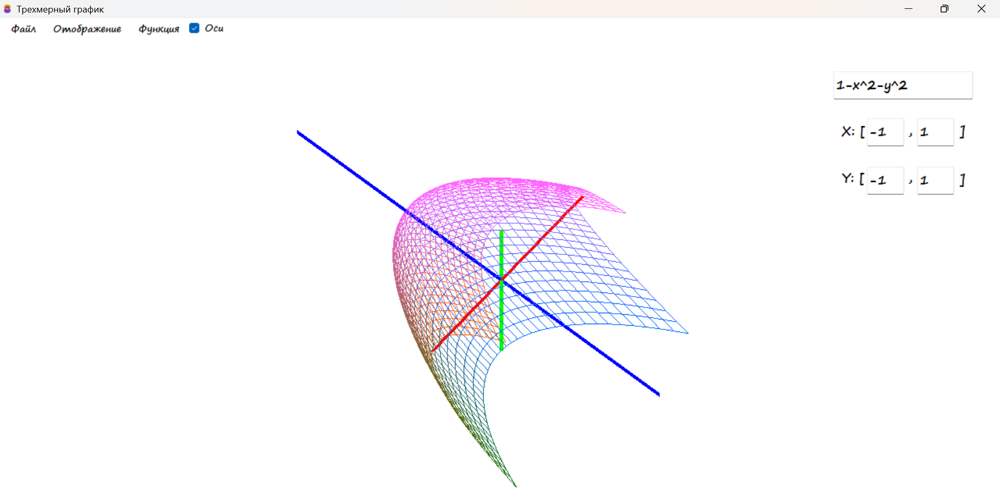

График можно задавать и в параметрическом виде. Для этого нужно выбрать настройку Функция -> Параметрическая. 

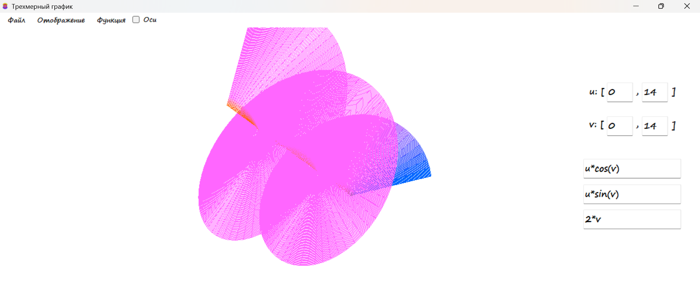

Если сетка слишком плотная или разреженная, то в настройках отображения можно поменять шаг.

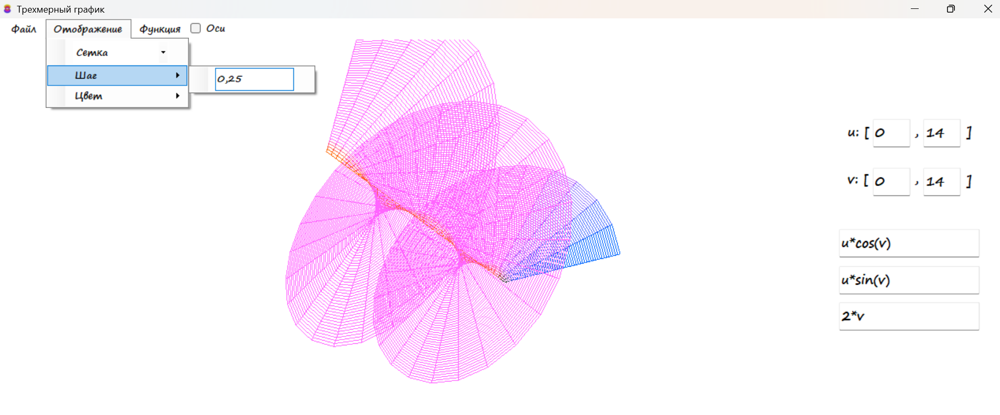

С помощью данной программы можно визуализировать многие графики в параметрическом виде. Например тор с R = 3:

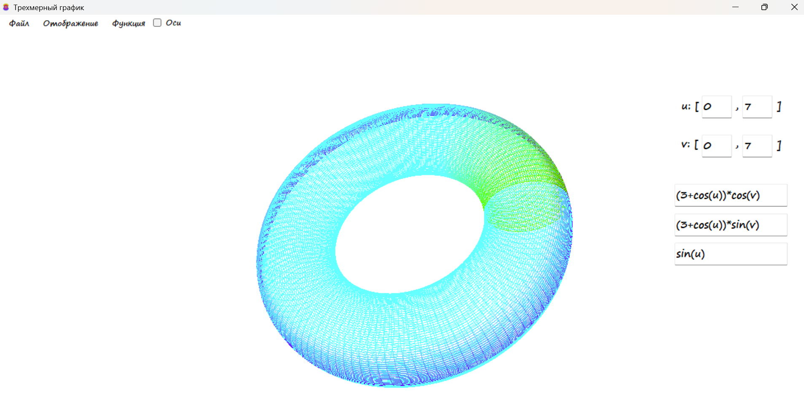

Можно смотреть как графики функций меняются в зависимости от параметров. Вот что будет, если для тора поставить R = 1: 

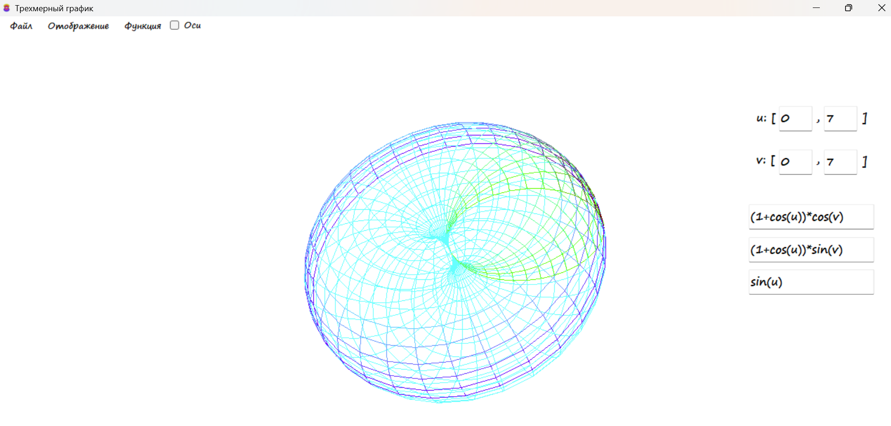

В программе присутствует возможность сохранять графики (вкладка Файл) в виде формул (для последующего открытия в этой же программе) или в виде точек (для встраивания графиков в свои программы). В директории "Сохраненные поверхности" уже сохранены некоторые графики функций. Например однополостный гиперболоид:

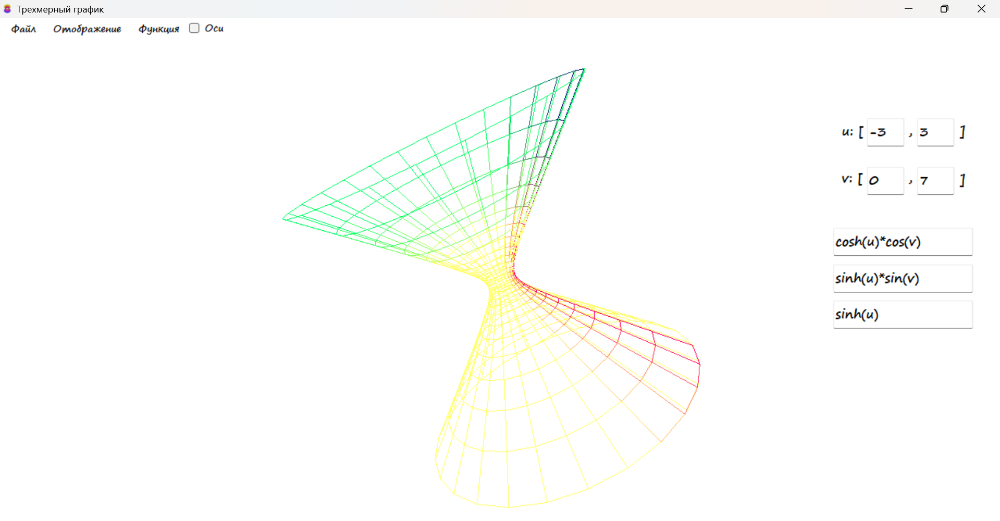

Эллипсоид:

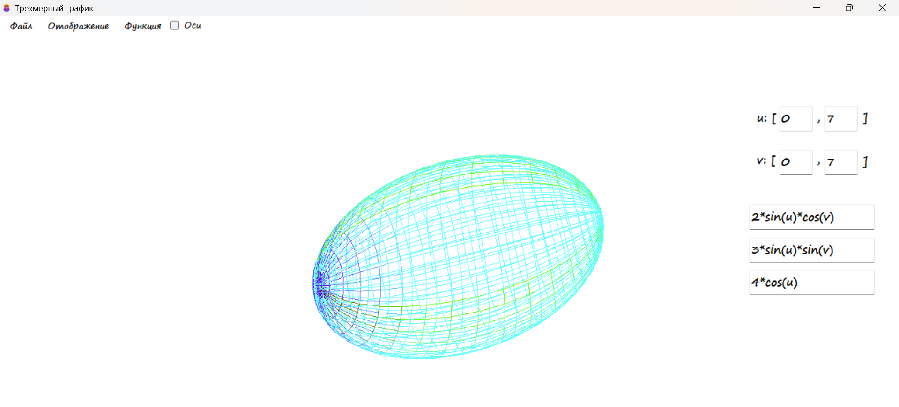

Эллиптический цилиндр:

Также есть возможность открывать наборы точек из сторонних программ:

