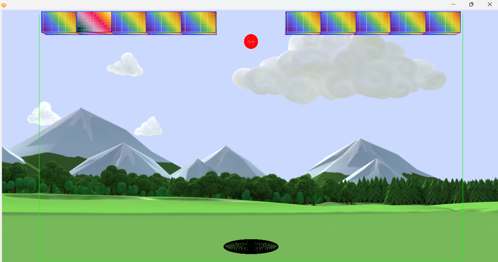

**Игра Арканоид** - классическая игра с движущейся платформой, цель которой - попасть движущимся мячом во все блоки на карте. В настройках игры можно задать сложность и изменить формат игры. 

**Пример использования**:

При запуске игры нас встречает следующее окно. В нем описано управление платформой, и доступен выбор сложности игры. Сложность игры меняется при изменении ползунка "Количество блоков". Также можно убрать галочку "Закрытые стенки, чтобы мяч мог вылетать за границы экрана и появляться в противоположном месте. Чтобы начать игру нужно нажать клавишу Enter (2 раза).

Цель игры: сбить все блоки мячом, отскакивающим от платформы. Если мяч упадет на "землю" вне платформы, то игра будет проиграна. Чтобы выйграть, необходимо последовательно направлять мяч с помощью платформы, чтобы он коснулся всех блоков, тогда игра будет выйграна. Редкие блоки другого цвета более "крепкие", и их нужно коснуться несколько раз.

Вот что будет, если увеличить количество блоков:

Если убрать галочку "Закрытые стенки", то мяч будет пролетать через экран, что добавит сложности:

Также можно включить "3Д режим":

