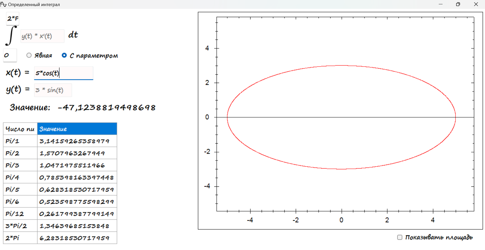

**Определенный интеграл** - программа позволяющая численно найти определенный интеграл от пользовательской функции. Функция записывается пользователем в интерфейсе программы (в явном или параметрическом виде), а также указываются границы отрезка. Программа вычисляет интеграл от введенной функции и визуализирует соответстующую площадь под графиком. 

**Пример использования**:

Необходимо ввести подынтегральную функцию и границы интегрирования. Границы могут быть указаны в целых числах, в виде десятичной дроби или с использованием числа Pi (если нужно Pi, то нужное значение лучше скопировать из таблицы). График можно двигать и приближать/отдалять с помощью колесика мыши. Десятичные значения границ следует записывать через запятую, а коэффициенты в подынтегральной функции - через точку. Чтобы вычислить интеграл, необходимо нажать клавишу Enter. 

Функция может быть записана в параметрическом виде (например если мы хотим взять интеграл от уравнения окружности или эллипса). 

На графике отображается подынтегральная функция и площадь между функцией и осью OX. Отображение площади можно отключить

