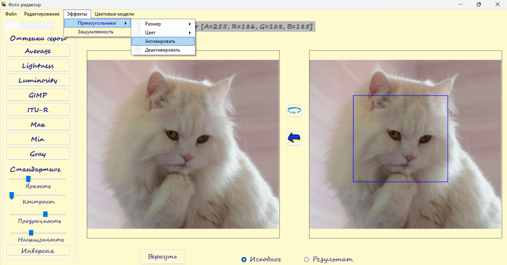

**Редактор фотографий** - программа для редактирования изображений с ярким интерфейсом, позволяющая редактировать снимки методами компьютерной обработки изображений. Программа имеет следующие возможности: позволяет привести изображение к оттенкам серого, изменить яркость, бинаризовать, добавить водяной знак, удалять/добавлять шум, применять методы математической морфологии к бинаризованным изображениям, выделять границы, применять фильтрацию (в том числе с пользовательским фильтром), менять цветовую модель и другие возможности (в том числе сохранять итоговое изображение). 

**Пример использования**:

Сперва следует открыть изображение (Файл -> Открыть), и выбрать изображение из папки, после чего оно отобразится в интерфейсе программы. 

Взаимодействуя с элементами интерфейса можно проводить обработку выбранного изображения, например привести его к оттенкам серого или изменить контраст. С правой стороны отобразится результат операции над изображением слева. 

Можно зафиксировать изменение, нажав на синюю стрелку между изображениями (правое изображение "перейдет" в левое, и изменения теперь будут проводиться на нем).

Для удобства можно изменить изображение к которому будут применяться все изменения с левого на правое (выбрав "Результат" в элементах внизу). Но результат всех операций (кроме поворота) все равно будет отображаться справа.

Изображения можно вращать, нажимая на кнопку "круговой стрелки" между изображениями. 

Нажатие правой кнопкой мыши будет приближать изображение в выбранной области. Нажатие левой кнопкой мыши будет отображать значения R,G,B выбранного пикселя (сверху изображений) и визуализировать данный цвет на фоне текста (сам текст будет противоположного цвета для лучшей читаемости). 

Можно применить инверсию к изображению:

Доступные операции расположены на нескольких вкладках. Например можно выбрать вторую вкладку и размыть изображение:

Или провести бинаризацию с выбранным порогом:

Над бинаризованными изображениями можно проводить морфологические операции (например выделение границ):

Изображения можно фильтровать доступными фильтрами 3x3, либо ввести свой фильтр:

На изображении можно разместить прямоугольные фигуры, выбрав Эффекты -> Прямоугольники -> активировать (после размещения нужно деактивировать режим размещения прямоугольника).

Выбрав Эффекты -> Зашумленность можно добавить к изображению случайный шум. 

На изображение можно наложить еще одно прозрачное (это может быть водяной знак), выбрав Файл -> Водяной знак -> Выбрать (выбрать изображение для совмещения) и Файл -> Водяной знак -> Добавить (добавить выбранное изображение по указанным координатам, которые можно менять). 

Можно изменить гамму (Редактирование -> Гамма изображения) или отразить изображение (Редактирование -> Отражение изображения):

Открыв вкладку "Цветовые модели -> Конвертер" откроется конвертер в цветовую модель HSV, позволяющий переводить значения (R, G, B) в (H, S, V). Значения можно вводить вручную либо выбирать пиксель на изображении левой кнопкой мыши (выбранный цвет и его значения в цветовых моделях сразу отображаются). 

 

Если в конвертере нажать на "Дополнительные возможности", то откроется подсказка про цветовую модель HSV. Выбирая соответствующие вкладки можно разложить изображение на (R, G, B) или (H, S, V) компоненты, а также установить определенные (H, S, V) значения для каждого пикселя изображения. Нажав на кнопку "Сохранить" в последней вкладке, можно перенести результат в основное окно программы для дальнейшего редактирования или сохранения изображения.

