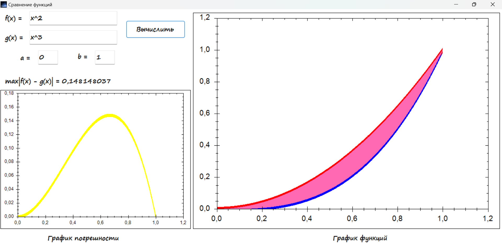
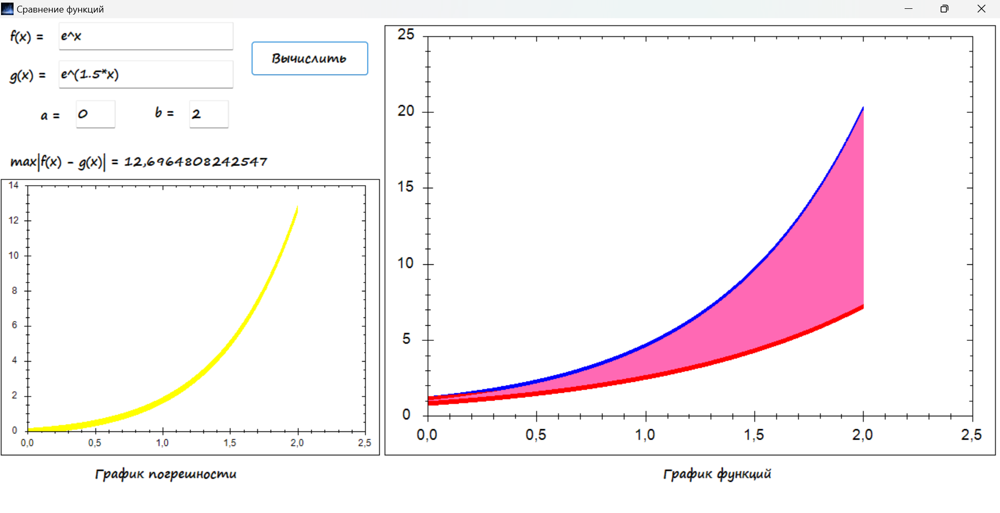

**Сравнение функций** - эта небольшая программа позволяет сравнивать две функции на заданном отрезке и находить погрешность между ними. Графики функций отображаются в интерфейсе программы, визуализируя пространство точек между ними, также доступен график погрешности. Программа может быть полезна в лабораторных работах, когда необходимо оценить отклонение одной функции от другой (например при сравнении исходной и аппроксимирующей функции). 

**Пример использования**:

При запуске программы появляется интерфейс с текстовыми полями для ввода функций. Чтобы сравнить две функции, нужно ввести их в текстовые поля и указать границы (a, b). Программа визуализирует график функций, разницу между ними и график погрешности. 

